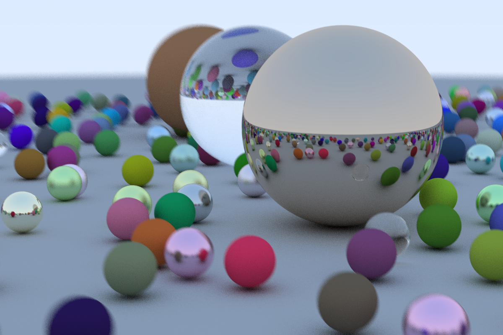

# Ray Tracer

Implementation of a basic ray tracer using the [Ray Tracing in One Weekend](http://in1weekend.blogspot.com/2016/01/ray-tracing-in-one-weekend.html) tutorial.

There is an implementation using basic C++, and also an implementation using CUDA to accelerate the ray tracer, based on the [NVIDIA Accelerated Ray Tracing in One Weekend in CUDA](https://devblogs.nvidia.com/accelerated-ray-tracing-cuda/) tutorial.

## Example

